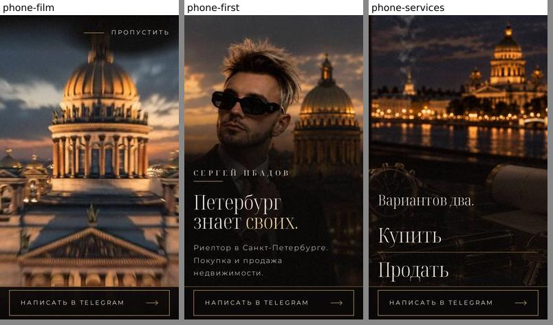

# Выпуск: первый экран, вступление и переход к услугам

9 октября 2026. Заказчик принял проверку и выбрал выпуск.

## Итог

- Ветка задачи `hero-work` слита в общую ветку `staging` коммитом слияния `9f47832` (`9f478323f4b943999f89596f5844826194ca928c`). Все проверки прошли на нём.
- Слияние отправлено на GitHub: `8aa3304..9f47832`.
- До конца выпуска после слияния в `staging` легли только документы: этот отчёт (`9d33f3d`) и его правка. Код, тесты и изображения в `staging` те же, что в проверенном слиянии.
- На конец выпуска вершина `staging` на GitHub — правка этого отчёта. Её хэш назван в отчёте о задаче: коммит не может записать собственный хэш.
- Позже `staging` уходит вперёд коммитами следующих стадий.
- Общего тестового сайта у задачи нет. Выпуск — это изменение в общей ветке `staging`, и только оно. Ни на какой сайт его не выкладывали.
- Ветки `main` и `production` не тронуты.

## Что вошло

- При каждом открытии сайта идёт фильм заказчика, 7 с. Он растворяется прямо в первый экран, тот готов к 7,8 с.
- «Пропустить», касание, клавиша или прокрутка сразу открывают первый экран.
- Первый экран и «Купить / Продать» на кадрах заказчика, в его цвете и шрифтах.
- Переход между ними — растворение, без линии между кадрами.
- Новые тексты, меню на компьютере, полоса с кнопкой Telegram на телефоне с первой секунды фильма.
- Без фильма: спокойная версия, экономия трафика, отказ браузера, ссылка на раздел, возврат кнопкой «Назад».

Подробно — в журнале изменений, запись от 9 октября 2026.

## Что не вошло

Заказчик попросил доработать тексты, расположение блоков и движение. Это отдельная следующая задача. В этот выпуск такие правки не вошли. Задача записана в «Дальше», раздел «Тексты, расположение блоков и движение».

## Проверка кода перед выпуском

Проверены изменения после прошлой проверки кода. Серьёзных дефектов нет, мелких пять.

- Два — неточности в дизайн-системе. Исправлены: порог телефона лёжа «500px и ниже» и когда кнопка первого экрана принимает нажатие.
- Три отложены в «Дальше», раздел «Мелочи из проверки кода перед выпуском». Они касаются вступления, а его доработка — следующая задача.

Документы проекта сверены с кодом. Четыре обновлены: объём, устройство, справочник и объяснение.

## Что проверено

- Все проверки проекта на слиянии, один раз перед отправкой: модульные, готовая страница и браузерные. Все прошли.
- Сборка сайта прошла.
- Сразу после отправки слияния `staging` на GitHub указывала на `9f47832`. В ней была ветка задачи целиком и файл фильма. Содержимое совпадало с веткой задачи на тот момент, `9530f1b`.
- На конец выпуска вершина `staging` на GitHub — коммит документов поверх слияния. Вне `docs/` она совпадала с проверенным слиянием.
- Собранный сайт из слияния открыт один раз в Chromium без окна, на компьютере 1440×900 и на iPhone 14:
  - фильм идёт, «Пропустить» видна;
  - нажатие «Пропустить» открывает первый экран, фокус на имени;
  - подзаголовок «Риелтор в Санкт-Петербурге. Покупка и продажа недвижимости.»;
  - прокрутка ведёт к «Вариантов два.», «Купить», «Продать»;
  - три кнопки ведут на t.me/ibadow;
  - ошибок в консоли нет.

Компьютер: фильм, первый экран, «Купить / Продать»: 

Телефон: фильм, первый экран, «Купить / Продать»: 

## Команды и результаты

Слияние и проверки:

- `git fetch origin staging`: код выхода 0.
- `git rev-parse origin/staging staging`: код выхода 0, обе `8aa3304`.
- `git checkout staging`: код выхода 0.
- `git merge --no-ff hero-work -m "Merge hero-work: the customer's film, the new first screen and the dissolve into services"`: код выхода 0, коммит `9f47832`, 118 файлов.
- `SITE_URL=https://example.test bun run build`: код выхода 0. Сборка сама запускает проверки устройства, свойств движения и списка изображений.
- `bun run test:unit`: код выхода 0, 186 прошли.
- `bun run test:html`: код выхода 0, 11 прошли.
- `paneweb down`, затем `PANEWEB_HOST=127.0.0.1 paneweb up`: код выхода 0, собранный сайт из слияния.
- `bun run test:e2e`: код выхода 0, 137 прошли за 3,5 мин, обе группы: раскладка и время.
- Поиск ключей и паролей в добавленных строках слияния: совпадений нет.

Отправка слияния:

- `git push origin staging`: код выхода 0, `8aa3304..9f47832  staging -> staging`.
- `git fetch origin staging`, `git rev-parse staging origin/staging`: код выхода 0, обе `9f478323f4b943999f89596f5844826194ca928c`.
- `git ls-remote origin refs/heads/staging`: код выхода 0, `9f478323f4b943999f89596f5844826194ca928c`.
- `git merge-base --is-ancestor hero-work origin/staging`: код выхода 0, ветка задачи в `staging`.
- `git diff --stat hero-work origin/staging`: код выхода 0, различий нет. Тогда `hero-work` стояла на `9530f1b`, `origin/staging` — на `9f47832`.
- `git cat-file -e origin/staging:src/blocks/opening/assets/intro-cut.mp4`: код выхода 0, фильм в ветке.

Отчёт о выпуске, коммит документов `9d33f3d` поверх слияния:

- `git push origin staging`: код выхода 0, `9f47832..9d33f3d  staging -> staging`.
- `git ls-remote origin refs/heads/staging`: код выхода 0, `9d33f3dce67eb3f1f7f69ac34a4a24894978dfc5`.
- `git checkout hero-work`, затем `git merge --ff-only staging`: код выхода 0, `hero-work` на `9d33f3d`.

Перед правкой этого отчёта:

- `git fetch origin staging`: код выхода 0.
- `git ls-remote origin refs/heads/staging`: код выхода 0, `9d33f3dce67eb3f1f7f69ac34a4a24894978dfc5`.
- `git diff --stat 9f47832 origin/staging`: только `docs/designs/hero/release.md` и два изображения к нему.
- `git diff --quiet 9f47832 origin/staging -- . ':!docs'`: код выхода 0, вне `docs/` различий нет.

Отчёт и его правка добавлены в `staging` отдельными коммитами после выпуска. Они меняют только документы, поэтому проверки после них не повторялись.

## Что остаётся

- В репозитории нет выкладки по отправке в ветку. Когда и как выкладывать сайт, решает человек.
- Сборка для настоящего сайта задаёт его адрес в `SITE_URL`. От адреса зависит картинка карточки ссылки.
