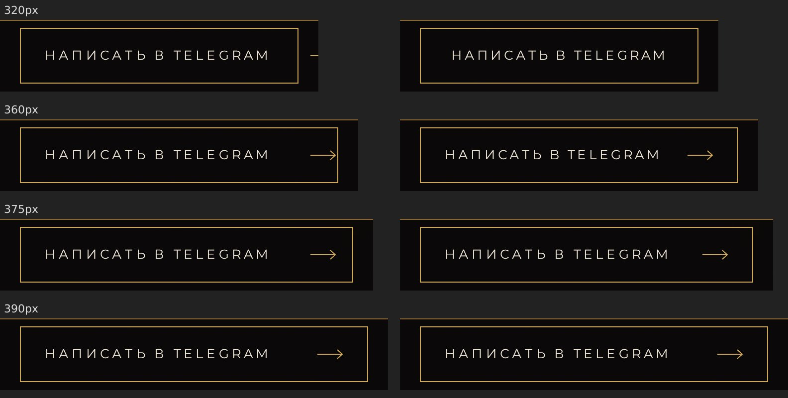
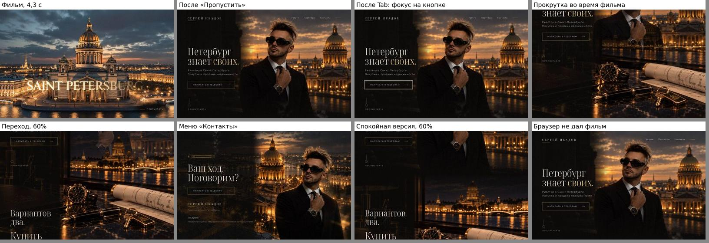
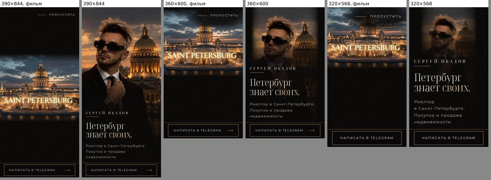
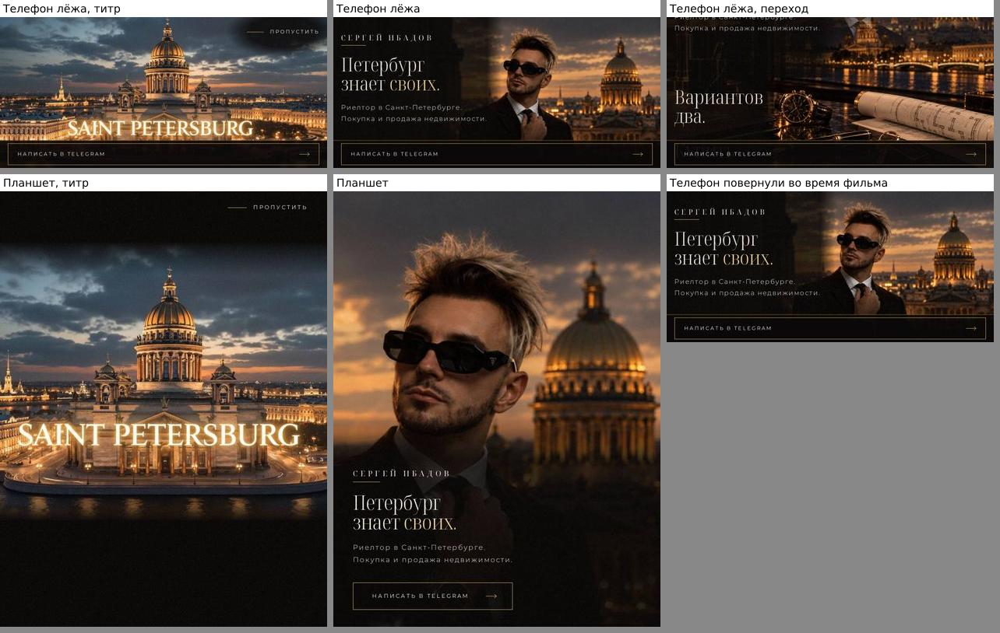

# Проверка перед приёмкой: первый экран, вступление и переход

8 октября 2026. Проверена ветка задачи после визуальной проверки: собранный сайт в Chromium без окна, как посетитель.

## Итог

- Готово к приёмке заказчика на iPhone. Ничего не мешает.
- Найден один дефект: кнопка Telegram в полосе на узком телефоне. Исправлен и проверен.
- Оценка здоровья: 98,9 из 100 до правки, 99,7 после. Оставшиеся 0,3 — подпись кнопки при увеличении браузера 300%, раздел «Что остаётся».
- Ошибок в консоли нет. Битых ссылок нет. Все загрузки страницы прошли без ошибок.

## Что проверено

Экраны:

- компьютер: 1440×900 и 1366×768;
- планшет стоймя: 768×1024;
- телефон стоймя: 390×844, короткие 360×600 и 320×568;
- телефон лёжа: 844×390.

На каждом экране проверены пункты Брифа из раздела «Готово, когда».

- **Фильм при открытии.** Идёт при каждом открытии, 7,8 с от начала до готового первого экрана. Титр «SAINT PETERSBURG» на телефоне виден целиком.
- **«Пропустить».** Видна весь фильм: на компьютере справа внизу, на телефоне и планшете справа вверху. Нажатие открывает первый экран, фокус встаёт на имя.
- **Клавиша, касание, прокрутка.** Любая из них заканчивает фильм. После пробела страница стоит вверху. После прокрутки страница листается дальше.
- **Tab во время фильма.** Открывает первый экран, рамка фокуса на кнопке Telegram. Дальше Tab идёт по меню, к кнопке в финале и к Instagram, рамка видна везде.
- **Первый экран.** Композиция, цвет и шрифты как на кадре заказчика. Тексты слово в слово по Брифу.
- **Переход к «Купить / Продать».** Стол выходит из чёрного, балкон растворяется сквозь него. Линии между кадрами нет. Под ним «Вариантов два.», «Купить», «Продать».
- **Связь.** Все три кнопки ведут на t.me/ibadow, страница Telegram «Sergei Ibadov, @ibadow» открывается. На телефоне полоса с кнопкой внизу с первой секунды фильма. На компьютере и планшете кнопка появляется с первым экраном.
- **Меню.** «Услуги» ведёт к «Купить / Продать», «Контакты» — к финалу. На телефоне и планшете меню нет, как в дизайн-системе.
- **Без фильма.** Спокойная версия, экономия трафика, отказ браузера, ссылка на раздел страницы, возврат кнопкой «Назад», обновление посреди страницы: фильма нет, первый экран сразу. При отказе браузера первый экран готов за 0,05–0,12 с.
- **Без скриптов.** Первый экран и кнопка на месте, «Пропустить» нет.

## Найдено и исправлено

1. Кнопка Telegram в полосе на узком телефоне.
   - Стрелка стояла дальше от подписи, чем позволяла ширина. На 375px она съедала поле справа, на 360px ложилась на рамку, уже 349px выходила за рамку к краю экрана.
   - Где: iPhone SE, iPhone 13 mini, iPhone с крупным масштабом экрана, телефоны Android шириной 360px.
   - Теперь стрелка стоит в 16px от подписи и в 24px от рамки. Уже 375px подпись чуть плотнее, как у кнопки в узком окне. Уже 349px стрелки нет, подпись стоит по центру рамки.
   - С 390px кнопка не изменилась.
   - Правило дописано в дизайн-систему. Новая проверка на десяти размерах телефона.

Слева «до», справа «после», телефоны шириной 320, 360, 375 и 390px: 

## Как выглядит сейчас

- Компьютер: фильм, пропуск, Tab, прокрутка, переход, меню, спокойная версия, отказ браузера: 
- Телефоны 390×844, 360×600 и 320×568, фильм на 6 с и первый экран: 
- Телефон лёжа и планшет, и телефон, повёрнутый во время фильма: 

## Что остаётся

- Приёмка на iPhone в Safari и в браузере Instagram. Всё проверено в Chromium. Движок Safari на этой машине не запускается: не хватает системных библиотек.
- Если повернуть телефон во время фильма, фильм кончается и открывается первый экран. Бриф этот случай не описывает, первый экран после поворота верный.
- Карточка тестовой ссылки в Instagram и Telegram будет без картинки: тестовый сайт собран с условным адресом. На настоящем сайте картинка своя.
- При увеличении браузера 300% в окне 800×700 подпись кнопки в полосе всё ещё выходит за рамку: колонна там уже 270px. Требование доступности — до 320px, там кнопка в рамке.
- Скорость мерили на сервере в той же машине. Первый экран без фильма готов за 0,6 с. В мобильной сети будет дольше.

## Оценка здоровья

До правки 98,9, после 99,7 из 100.

- Консоль: 100. Ошибок нет.
- Ссылки: 100. Битых нет.
- Внешний вид: 89 до правки, 97 после. Кнопка в полосе, средний дефект, исправлен. Подпись кнопки при увеличении 300%, мелкий, оставлен.
- Работа: 100.
- Удобство: 100.
- Скорость: 100.
- Тексты: 100.
- Доступность: 100.

## Команды и результаты

- `PANEWEB_HOST=127.0.0.1 paneweb up`: код выхода 0, сайт на 127.0.0.1.
- `paneweb down`, затем `PANEWEB_HOST=127.0.0.1 paneweb up` после правки: код выхода 0.
- `bunx playwright test tests/e2e/phone-bar.spec.ts --project layout` до правки: код выхода 1, 6 из 10 упали. Новая проверка ловит дефект.
- `bunx playwright test tests/e2e/phone-bar.spec.ts --project layout` после правки: код выхода 0, 10 прошли.
- `bunx playwright test tests/e2e/phone-bar.spec.ts tests/e2e/phone.spec.ts tests/e2e/design-check.spec.ts tests/e2e/hero-near-square.spec.ts --project layout`: первый запуск — код выхода 1, 74 прошли. Одна проверка не начиналась: процесс браузера не получил адрес сайта от `paneweb url`. Повтор — код выхода 0, 75 прошли.
- `bunx playwright test tests/e2e/intro.spec.ts tests/e2e/calm.spec.ts tests/e2e/smooth.spec.ts --no-deps`: код выхода 0, 36 прошли.
- `bun run test:unit`: код выхода 0, 186 прошли.
