# Визуальная проверка: первый экран, вступление и переход

8 октября 2026. Проверена ветка задачи после код-ревью: собранный сайт в Chromium без окна.

## Итог

- Первый экран повторяет кадр заказчика: композиция, цвет, шрифты, кнопка в золотой рамке. Тексты слово в слово по Брифу.
- Найдено четыре дефекта. Все исправлены и проверены на скриншотах.
- Один дефект оставлен: почти квадратные окна компьютера, подробно в разделе «Что остаётся».
- Оценка дизайна: B+ до правок, A− после. Шаблонности нет: A до и после.
- Контраст текста первого экрана не ниже 7,6 к 1 на всех 13 экранах. Надпись «Пропустить» за весь фильм на компьютере и телефоне — не ниже 9,9 к 1.

## Как смотрели

- Экраны:
  - компьютер: 1920×1080, 1440×900, 1366×768, 1280×720, 1024×768;
  - планшет стоймя: 768×1024;
  - телефон стоймя: 390×844, 375×667, 360×780;
  - телефон лёжа: 740×360, 844×390, 667×375;
  - узкое окно лёжа: 700×600.
- Вступление снимали по часам фильма: 0,8; 2,0; 3,2; 4,4; 5,6; 6,3; 6,8 и 7,2 с. Растворение в первый экран — ещё чаще.
- Переход снимали на 30, 60 и 90% ухода первого экрана и на сцене «Купить / Продать».
- Спокойную версию снимали на компьютере и на телефоне.
- Расстояние от титра фильма до имени мерили на 12 размерах телефона и планшета.
- Перенос подзаголовка проверили на 22 размерах окон лёжа.
- Кадры заказчика с балконом и со столом поставили рядом со страницей.
- Второе мнение: другая модель и отдельный проверяющий прочли код ветки.

## Сравнение с кадрами заказчика

- Совпадает: имя титром слева вверху с золотой линией и меню справа с линией.
- Совпадает: заголовок в две строки с золотым последним словом, подзаголовок, кнопка в золотой рамке со стрелкой, «Пролистайте» внизу слева.
- Цвет кадров не тронут.
- Отличия утверждены в Брифе: тексты, пункты меню, кнопка «Написать в Telegram». Заголовок стоит по центру высоты, как велит дизайн-система.
- Сцена «Купить / Продать» стоит на кадре со столом. Колонна текста кончается до часов.

## Исправлено

1. Город в подзаголовке рвался по дефису: «Риелтор в Санкт- / Петербурге.».
   - Где: телефон лёжа 568×320, 640×360, 667×375, узкие окна лёжа и окно 1100×1000.
   - Теперь строка переносится перед «в Санкт-Петербурге.», город целиком.
   - Исключение — увеличение браузера 250–300%: колонна там уже названия города. Там перенос по дефису остался, иначе текст заходит на лицо.
   - Новая проверка на восьми экранах.
2. На телефоне стоймя имя при растворении фильма проявлялось прямо поверх титра «SAINT PETERSBURG».
   - Где: 360×740, 360×780, 360×800, 375×812 и планшет 768×1024. Наложение до 42px. На 360×640 и 375×667 на титр ложился заголовок.
   - Теперь фильм, отъезжая, ещё и поднимается. Титр кончается за 24px над именем, имя встаёт под ним второй строкой титров.
   - На высоких телефонах, от 412×915, ничего не изменилось.
   - Новая проверка на пяти экранах.
3. На телефоне после касания кнопка «Написать в Telegram» оставалась залитой золотом.
   - Telegram открывается поверх страницы. Посетитель возвращался, а кнопка была уже не рамкой, а золотым бруском.
   - Теперь заливка только при наведении мышью.
4. В окне лёжа уже 768px имя стояло слева вверху, как на компьютере, хотя меню там уже нет.
   - По дизайн-системе на телефоне лёжа имя стоит над заголовком. Теперь так.

Правила 1, 2 и 3 дописаны в дизайн-систему. Правило 2 — ещё и в Бриф, раздел «Вступление».

## Оставлено как есть

- Затемнение под «Пропустить» видно тёмным пятном над светлым небом, ярче всего на телефоне лёжа. Так решено в Брифе, раздел «Доступность»: без него надпись местами падала до 1 к 1.
- На телефоне фильм отъезжает с 3,75 до 4,65 с, а титр печатается с 3,97 с. Полсекунды края титра срезаны. Это утверждённое движение.
- На компьютере подзаголовок и кнопка проявляются, пока титр фильма ещё виден, около 0,2 с. Это само растворение фильма в первый экран.
- Имя Сергея появляется только к концу фильма. Второе мнение назвало это слабым брендом. Фильм перед первым экраном — просьба заказчика.
- Заголовок «Вариантов два.» на компьютере стоит в две строки. Колонна текста кончается до часов, как в дизайн-системе.

## Что остаётся

- Почти квадратные окна компьютера, от 800×700 до 1024×1000.
  - Слово «Петербург» шире колонны текста, и заголовок доходит до лица Сергея.
  - В узких окнах лёжа, 600–767px, имя и заголовок занимают по две-три строки.
  - Такие окна бывают, только если окно браузера сузили вручную. Нужно решение о размере заголовка. До выпуска не обязательно.
- iPhone, Safari и Instagram не проверены: всё снято в Chromium. Поднятие фильма над именем и кнопку после касания покажет приёмка на iPhone.
- Телефоны стоймя ниже 640px не проверяли. На них фильм поднимается ближе к «Пропустить».
- Скорость мерили на сервере в той же машине. Первый экран без фильма готов за 0,6 с на компьютере, сдвигов нет. В мобильной сети будет дольше.

## Скриншоты и клипы

Слева «до», справа «после»:

- Пункт 1, телефон лёжа 667×375: 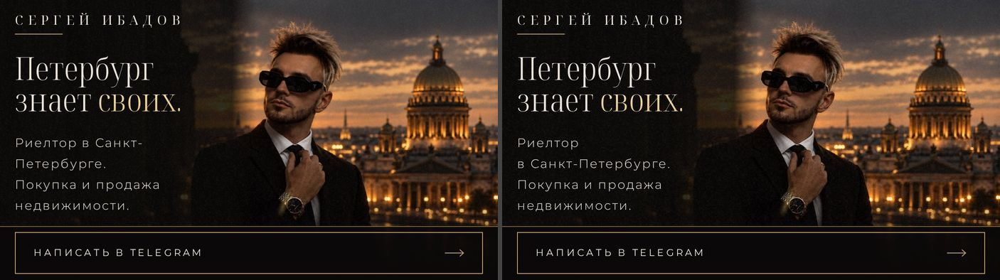
- Пункт 2, телефон 360×780 на 6,8 с: 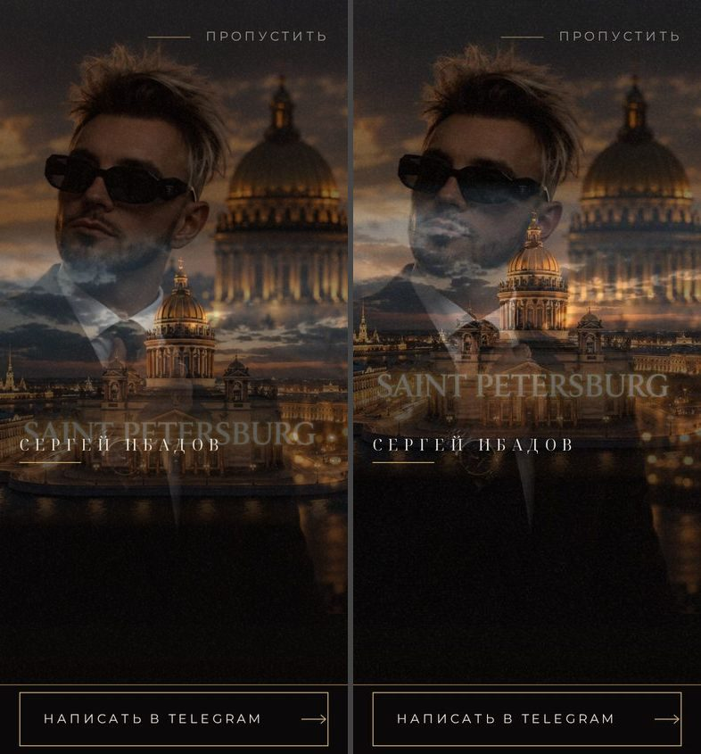
- Пункт 3, полоса телефона после касания: 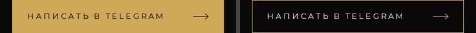
- Пункты 1 и 4, окно 700×600: 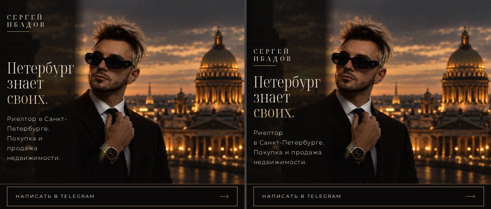

Как сейчас:

- Кадры заказчика и страница рядом: 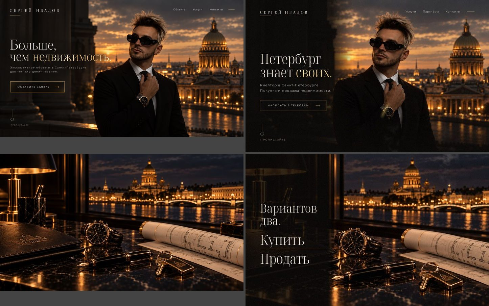
- Первый экран на компьютере: 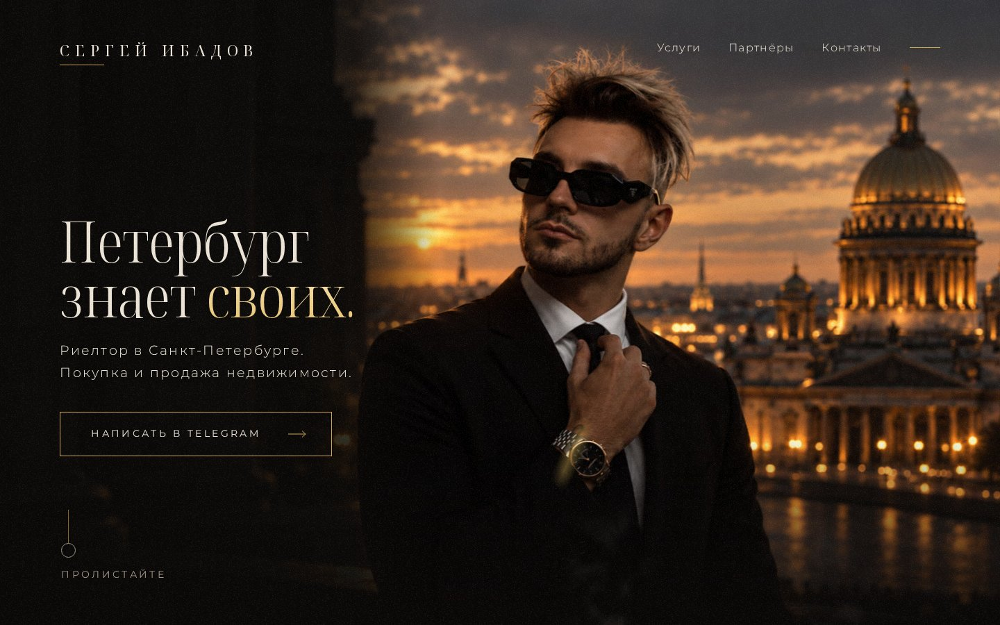
- Первый экран на телефоне: 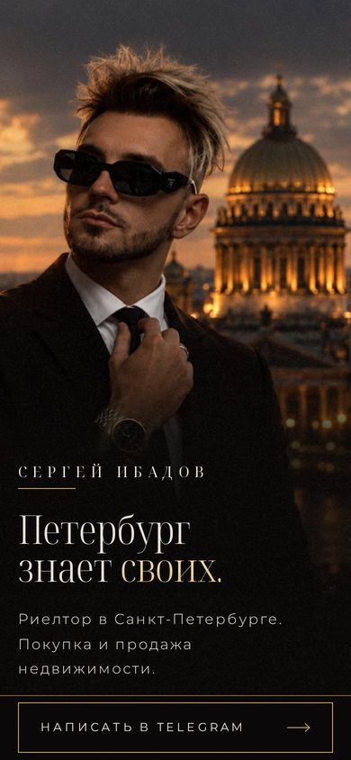
- Первый экран на телефоне лёжа: 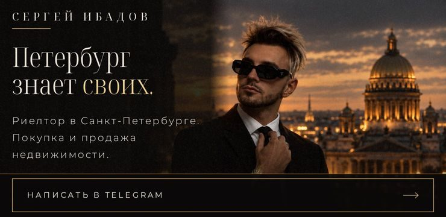
- Остальные широкие экраны: 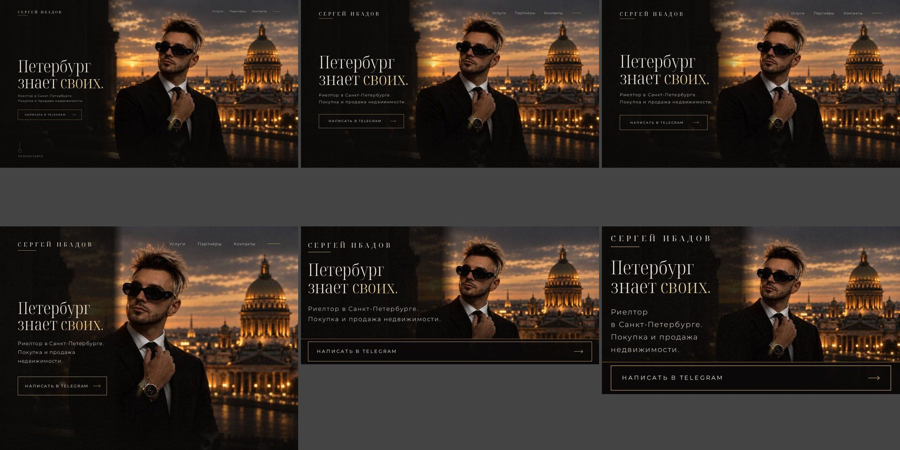
- Планшет, телефоны и узкое окно: 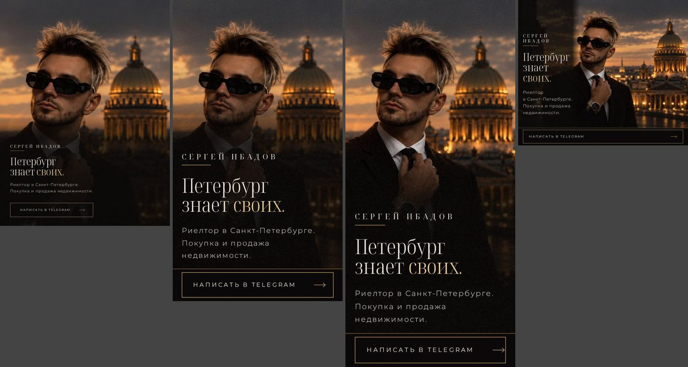
- Вступление на компьютере: 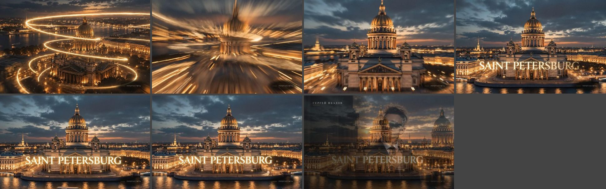
- Вступление на телефоне: 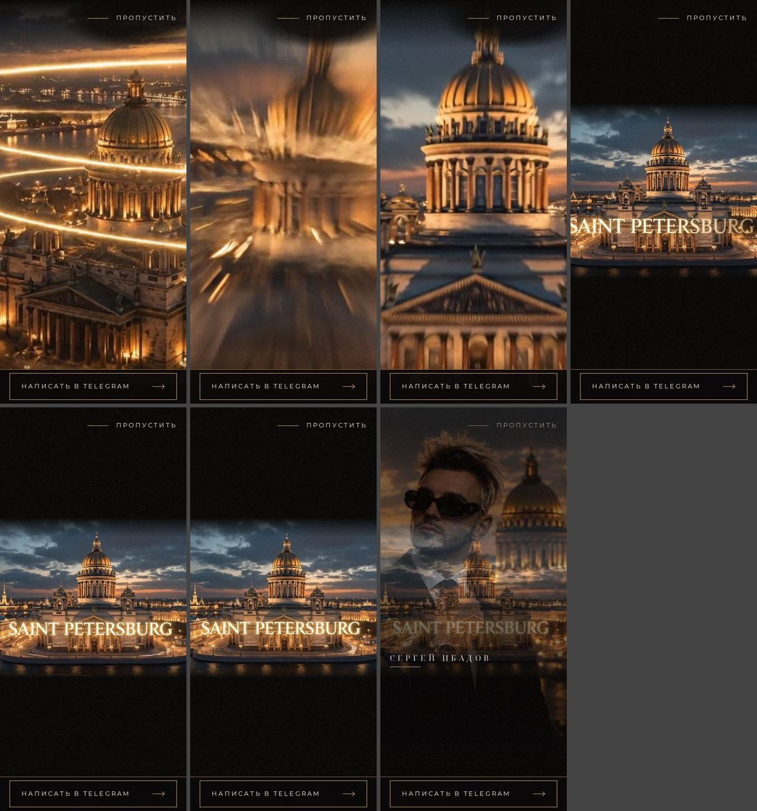
- Вступление на телефоне лёжа: 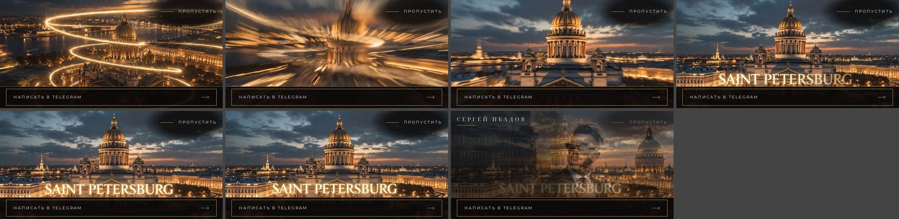
- Вступление в узком окне: 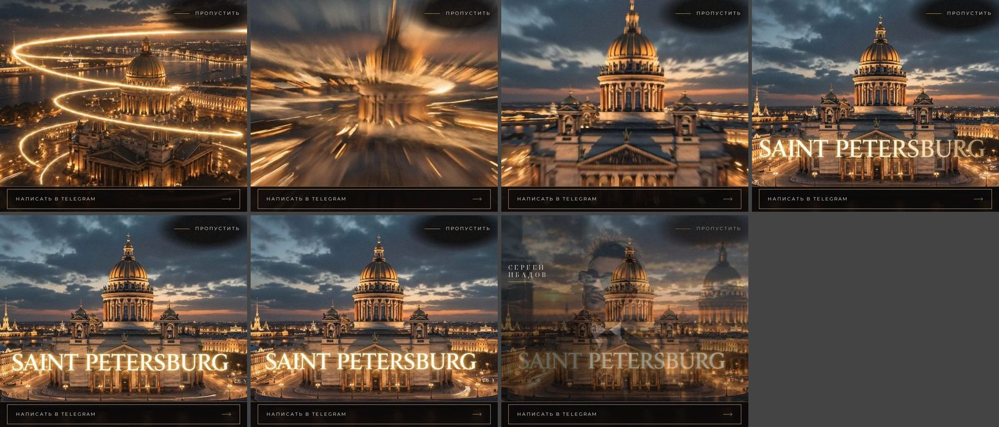
- «Пропустить» крупно в самые светлые моменты: 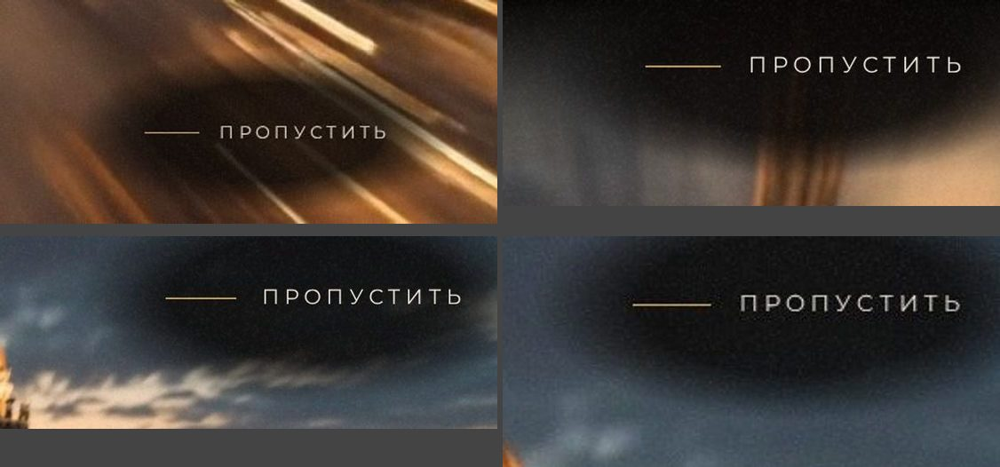
- Переход на компьютере: 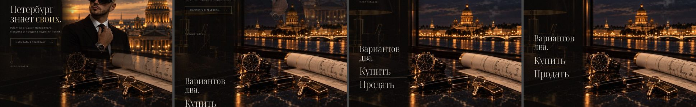
- Переход на телефоне: 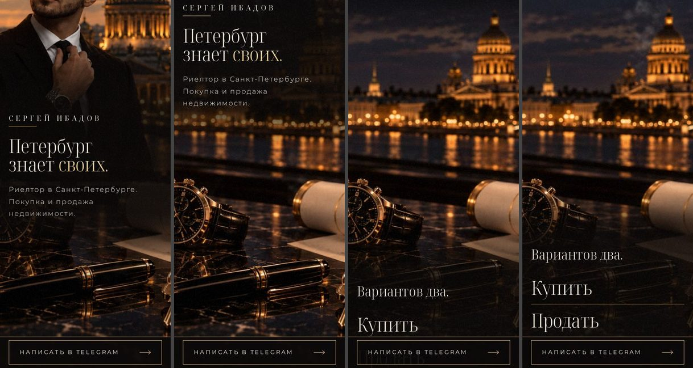
- Переход на телефоне лёжа: 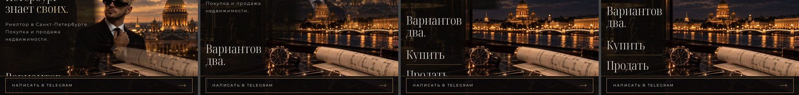
- Спокойная версия: 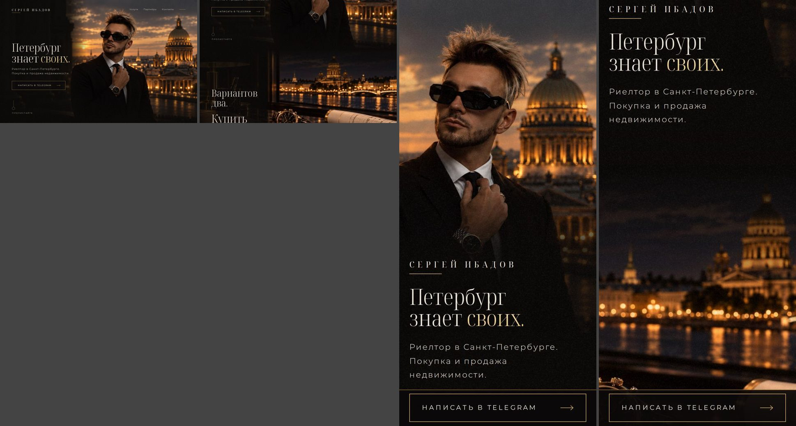

Клипы:

- [Вступление на компьютере](visual-check/intro-desktop.mp4)
- [Вступление на телефоне](visual-check/intro-phone.mp4)
- [Вступление на телефоне лёжа](visual-check/intro-sideways.mp4)
- [Переход на компьютере](visual-check/transition-desktop.mp4)
- [Переход на телефоне](visual-check/transition-phone.mp4)

## Команды и результаты

- `paneweb down`, затем `paneweb up` (сборка сайта для проверок), после каждой правки: код выхода 0.
- `bun test ./tests/html.test.ts`: код выхода 0, 11 прошли.
- `bunx playwright test tests/e2e/hero-lead.spec.ts tests/e2e/nojs.spec.ts tests/e2e/seam.spec.ts tests/e2e/design-check.spec.ts --project layout`: код выхода 0, 41 прошли.
- `bunx playwright test tests/e2e/intro.spec.ts tests/e2e/calm.spec.ts --no-deps`: код выхода 0, 35 прошли.
- `bunx playwright test tests/e2e/intro.spec.ts --no-deps -g "portrait|reads at 7:1|whole film" --repeat-each 2`: код выхода 0, 8 прошли. Новая проверка не плавает.
- `bunx tsc --noEmit`: код выхода 1. Четыре старые ошибки `TS2307` в `src/blocks/card/index.ts` и `src/blocks/contact/index.ts`. Эти файлы ветка не трогала. В изменённых файлах ошибок нет.
