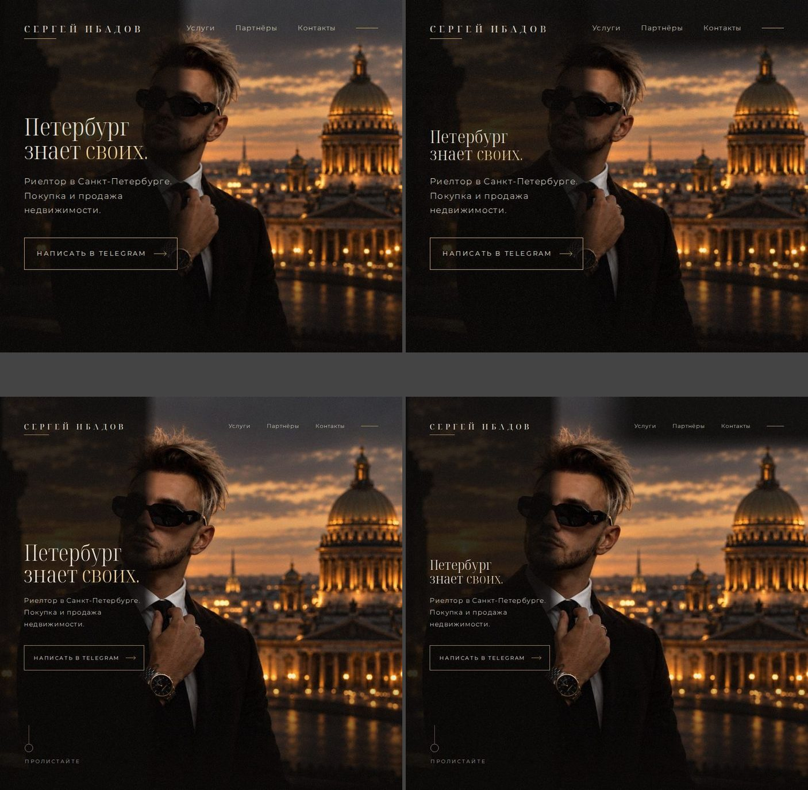
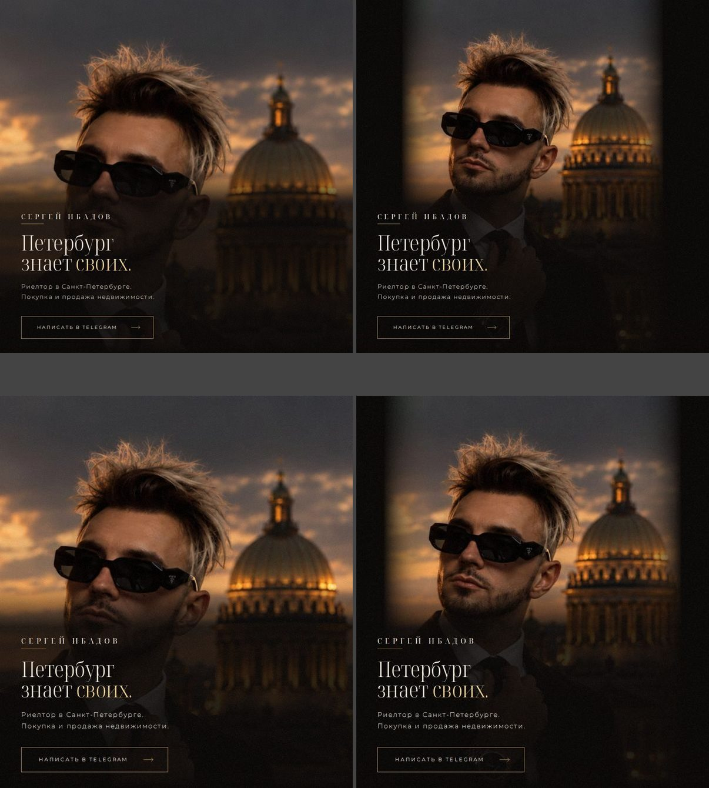
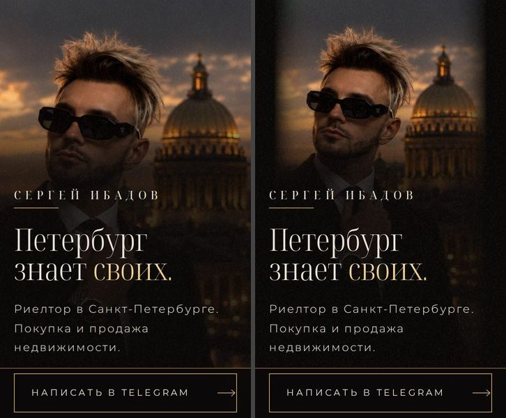
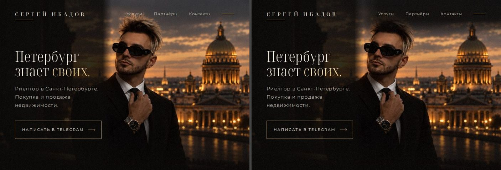
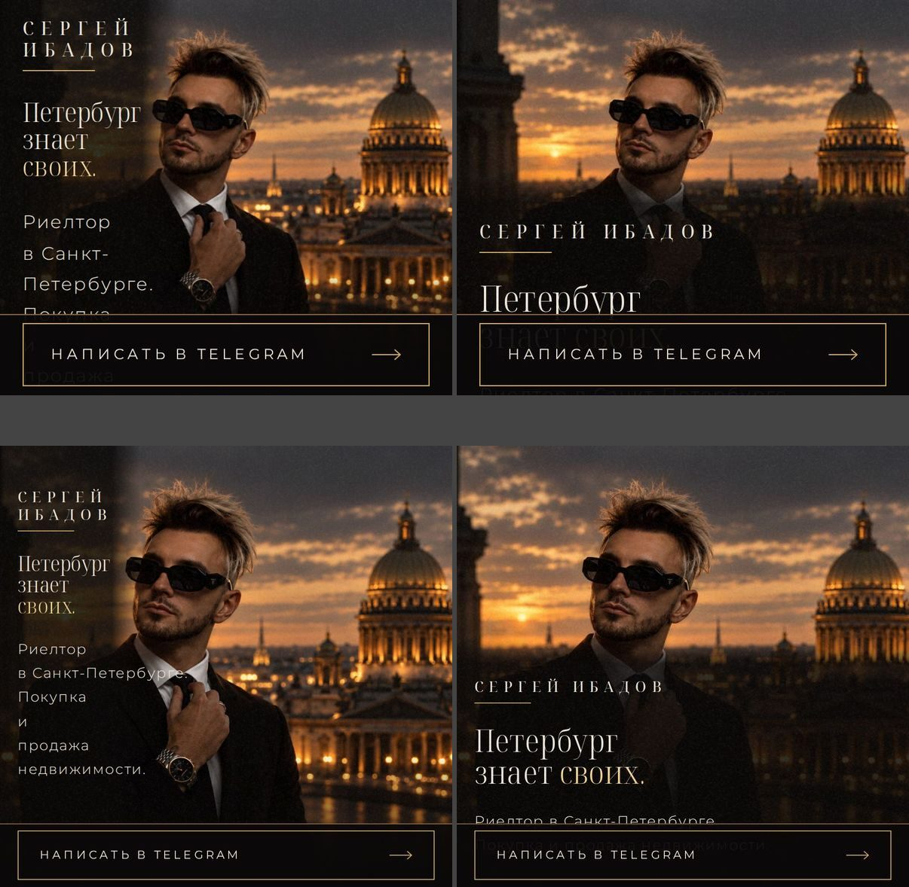
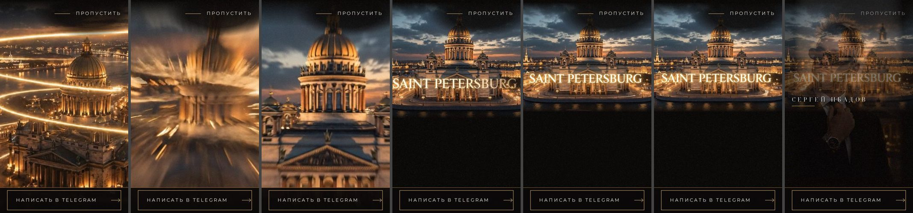

# Визуальная проверка: первый экран, вступление и переход

8 октября 2026. Проверена ветка задачи после код-ревью: собранный сайт в Chromium без окна.

## Итог

- Первый экран повторяет кадр заказчика: композиция, цвет, шрифты, кнопка в золотой рамке. Тексты слово в слово по Брифу.
- Найдено восемь дефектов. Все исправлены и проверены на скриншотах. Четыре из них — в почти квадратных окнах и на коротких телефонах, пункты 5–8.
- Оценка дизайна: B+ до правок, A− после. Шаблонности нет: A до и после.
- Контраст текста первого экрана не ниже 7,6 к 1 на всех 13 экранах, на почти квадратных окнах и коротких телефонах — не ниже 8,0 к 1. Меню в узком окне — не ниже 12,8 к 1. Надпись «Пропустить» за весь фильм на компьютере и телефоне — не ниже 9,9 к 1.

## Как смотрели

- Экраны:
  - компьютер: 1920×1080, 1440×900, 1366×768, 1280×720, 1024×768;
  - планшет стоймя: 768×1024;
  - телефон стоймя: 390×844, 375×667, 360×780;
  - телефон лёжа: 740×360, 844×390, 667×375;
  - узкое окно лёжа: 700×600.
- Вступление снимали по часам фильма: 0,8; 2,0; 3,2; 4,4; 5,6; 6,3; 6,8 и 7,2 с. Растворение в первый экран — ещё чаще.
- Переход снимали на 30, 60 и 90% ухода первого экрана и на сцене «Купить / Продать».
- Спокойную версию снимали на компьютере и на телефоне.
- Расстояние от титра фильма до имени мерили на 12 размерах телефона и планшета.
- Перенос подзаголовка проверили на 22 размерах окон лёжа.
- Почти квадратные окна и короткие телефоны:
  - лёжа: окна шириной 768–1100px и высотой 560–1000px;
  - стоймя: окна от 300×560 до 1300×1400, среди них 360×600 и 320×568;
  - увеличение браузера 125–300% для окон 800×700, 900×800, 1024×900, 1024×1000, 1000×1000 и 1280×1024;
  - контраст меню — на окнах лёжа от 768×520 до 1920×1080.
- Мерили буквы, а не блоки: расстояние от каждой строки имени, заголовка и подзаголовка до лица.
- Кадры заказчика с балконом и со столом поставили рядом со страницей.
- Второе мнение: другая модель и отдельный проверяющий прочли код ветки.

## Сравнение с кадрами заказчика

- Совпадает: имя титром слева вверху с золотой линией и меню справа с линией.
- Совпадает: заголовок в две строки с золотым последним словом, подзаголовок, кнопка в золотой рамке со стрелкой, «Пролистайте» внизу слева.
- Цвет кадров не тронут.
- Отличия утверждены в Брифе: тексты, пункты меню, кнопка «Написать в Telegram». Заголовок стоит по центру высоты, как велит дизайн-система.
- Сцена «Купить / Продать» стоит на кадре со столом. Колонна текста кончается до часов.

## Исправлено

1. Город в подзаголовке рвался по дефису: «Риелтор в Санкт- / Петербурге.».
   - Где: телефон лёжа 568×320, 640×360, 667×375, узкие окна лёжа и окно 1100×1000.
   - Теперь строка переносится перед «в Санкт-Петербурге.», город целиком.
   - Исключение — увеличение браузера 250–300%: колонна там уже названия города. Там перенос по дефису остался, иначе текст заходит на лицо.
   - Новая проверка на восьми экранах.
2. На телефоне стоймя имя при растворении фильма проявлялось прямо поверх титра «SAINT PETERSBURG».
   - Где: 360×740, 360×780, 360×800, 375×812 и планшет 768×1024. Наложение до 42px. На 360×640 и 375×667 на титр ложился заголовок.
   - Теперь фильм, отъезжая, ещё и поднимается. Титр кончается за 24px над именем, имя встаёт под ним второй строкой титров.
   - На высоких телефонах, от 412×915, ничего не изменилось.
   - Новая проверка на пяти экранах.
3. На телефоне после касания кнопка «Написать в Telegram» оставалась залитой золотом.
   - Telegram открывается поверх страницы. Посетитель возвращался, а кнопка была уже не рамкой, а золотым бруском.
   - Теперь заливка только при наведении мышью.
4. В окне лёжа уже 768px имя стояло слева вверху, как на компьютере, хотя меню там уже нет.
   - По дизайн-системе на телефоне лёжа имя стоит над заголовком. Теперь так.

5. В почти квадратном окне лёжа заголовок доходил до лица.
   - Где: окна от 768×560 до 1024×1000. «Петербург» и «знает своих.» шли по лицу, расстояние 0px.
   - Теперь заголовок мельчает вместе с местом до лица, но не меньше 1,5rem. Так он всё ещё в 1,4 раза крупнее подзаголовка.
   - Пример: в 800×700 заголовок 34px вместо 47px, в 1024×1000 — 35px вместо 56px. Он держит высоту двух строк, и подзаголовок к лицу не поднимается.
   - В окне ниже 641px подзаголовок тоже переносится до лица.
   - Расстояние от заголовка до лица теперь не меньше 37px, обычно 42px и больше. От подзаголовка — не меньше 34px.
   - Экраны из Брифа не изменились: в 1024×768 заголовок как был.
6. В почти квадратном окне стоймя и на коротком телефоне имя и заголовок ложились на лицо.
   - Где: окна от 412×500 до 1000×1000 и 1300×1400, телефоны 360×600 и 320×568. Там кадр во всю ширину, и лицо опускается до текста.
   - Теперь кадр сужается по центру, пока лицо не кончится за 40px до имени. Бока кадра тают в чёрное. Уже половины экрана кадр не бывает.
   - Имя теперь в 38px от лица, заголовок — в 82px и дальше. Первый экран по-прежнему в один экран, прокрутки нет.
   - Экраны Брифа стоймя не изменились: 360×780, 375×667, 390×844, 430×932, 768×1024, 820×1180.
   - Блик на часах идёт за суженным кадром: расхождение не больше 0,3px.
7. В узком окне лёжа меню лежало на волосах Сергея.
   - Где: окна шириной 768–1000px и высотой до 760px. Контраст «Услуги» падал до 2,7 к 1, по правилу сайта нужно 7 к 1.
   - Теперь в окне уже 1,55 к 1 под меню затемнение от верхнего и правого края экрана. За меню оно плавно сходит на нет. Контраст не ниже 12,8 к 1.
   - На широких экранах меню как на кадре заказчика, без затемнения.
8. При увеличении браузера 200–300% на почти квадратном окне текст ложился на лицо.
   - Где: 800×700, 900×800, 1024×1000 и 1040×800 при 200% и больше, 1024×900 — при 250% и больше. Рядом с лицом не было места даже на одно слово: текст шёл по слову в строку, по лицу, расстояние 0–27px.
   - Теперь текст стоит под лицом во всю ширину, на затемнении. Расстояние до лица не меньше 38px. Первый экран прокручивается.

Правила 1, 2, 3 и 5–8 дописаны в дизайн-систему. Правило 2 — ещё и в Бриф, раздел «Вступление».

## Оставлено как есть

- Затемнение под «Пропустить» видно тёмным пятном над светлым небом, ярче всего на телефоне лёжа. Так решено в Брифе, раздел «Доступность»: без него надпись местами падала до 1 к 1.
- На телефоне фильм отъезжает с 3,75 до 4,65 с, а титр печатается с 3,97 с. Полсекунды края титра срезаны. Это утверждённое движение.
- На компьютере подзаголовок и кнопка проявляются, пока титр фильма ещё виден, около 0,2 с. Это само растворение фильма в первый экран.
- Имя Сергея появляется только к концу фильма. Второе мнение назвало это слабым брендом. Фильм перед первым экраном — просьба заказчика.
- Заголовок «Вариантов два.» на компьютере стоит в две строки. Колонна текста кончается до часов, как в дизайн-системе.

## Что остаётся

- iPhone, Safari и Instagram не проверены: всё снято в Chromium. Поднятие фильма над именем, кнопку после касания и суженный кадр покажет приёмка на iPhone.
- В почти квадратном окне стоймя имя стоит в 38px от лица, а не в 40px. Это допустимо: 40px нужны на экранах Брифа, 32px — везде. На экранах Брифа имя дальше 52px.
- В почти квадратном окне лёжа уже 768px имя занимает две строки: в одну оно дошло бы до лица.
- При увеличении 200% и больше первый экран прокручивается. Подзаголовок и часть заголовка видны после прокрутки.
- При увеличении 300% окна 800×700 надпись кнопки в полосе телефона выходит за её рамку. Это полоса, а не первый экран. На телефоне 320×568 надпись в рамке.
- Скорость мерили на сервере в той же машине. Первый экран без фильма готов за 0,6 с на компьютере, сдвигов нет. В мобильной сети будет дольше.

Короткие телефоны проверены: 360×600 и 320×568.

- Титр фильма весь фильм стоит ниже «Пропустить»: на 135px и больше в 360×600, на 82px и больше в 320×568.
- Титр кончается за 23–25px над именем. Имя проявляется под титром.

## Скриншоты и клипы

Слева «до», справа «после»:

- Пункт 1, телефон лёжа 667×375: 
- Пункт 2, телефон 360×780 на 6,8 с: 
- Пункт 3, полоса телефона после касания: 
- Пункты 1 и 4, окно 700×600: 
- Пункт 5, окна 800×700 и 1024×1000: 
- Пункт 6, окна 1000×1000 и 900×1000: 
- Пункт 6, телефон 360×600: 
- Пункт 7, окно 880×600: 
- Пункт 8, окна 800×700 и 1024×1000 при увеличении 200%: 

Как сейчас:

- Кадры заказчика и страница рядом: 
- Первый экран на компьютере: 
- Первый экран на телефоне: 
- Первый экран на телефоне лёжа: 
- Остальные широкие экраны: 
- Планшет, телефоны и узкое окно: 
- Вступление на компьютере: 
- Вступление на телефоне: 
- Вступление на телефоне лёжа: 
- Вступление в узком окне: 
- Вступление на коротком телефоне, титр и «Пропустить»: 
- «Пропустить» крупно в самые светлые моменты: 
- Переход на компьютере: 
- Переход на телефоне: 
- Переход на телефоне лёжа: 
- Спокойная версия: 

Клипы:

- [Вступление на компьютере](visual-check/intro-desktop.mp4)
- [Вступление на телефоне](visual-check/intro-phone.mp4)
- [Вступление на телефоне лёжа](visual-check/intro-sideways.mp4)
- [Переход на компьютере](visual-check/transition-desktop.mp4)
- [Переход на телефоне](visual-check/transition-phone.mp4)

## Команды и результаты

- `paneweb down`, затем `paneweb up` (сборка сайта для проверок), после каждой правки: код выхода 0.
- `bun test ./tests/html.test.ts`: код выхода 0, 11 прошли.
- `bun run test:unit`: код выхода 0, 186 прошли.
- `bunx playwright test tests/e2e/hero-near-square.spec.ts tests/e2e/hero-lead.spec.ts tests/e2e/nojs.spec.ts tests/e2e/seam.spec.ts tests/e2e/design-check.spec.ts tests/e2e/phone.spec.ts tests/e2e/scripts.spec.ts --project layout`: код выхода 0, 91 прошли.
- `bunx playwright test tests/e2e/intro.spec.ts tests/e2e/calm.spec.ts tests/e2e/smooth.spec.ts --no-deps`: код выхода 0, 36 прошли.
- `bunx playwright test tests/e2e/hero-near-square.spec.ts --project layout` на коде до правок 5–8: код выхода 1, 23 из 24 тогдашних проверок упали. Новая проверка ловит эти дефекты.
- `bunx tsc --noEmit`: код выхода 1. Четыре старые ошибки `TS2307` в `src/blocks/card/index.ts` и `src/blocks/contact/index.ts`. Эти файлы ветка не трогала. В изменённых файлах ошибок нет.
