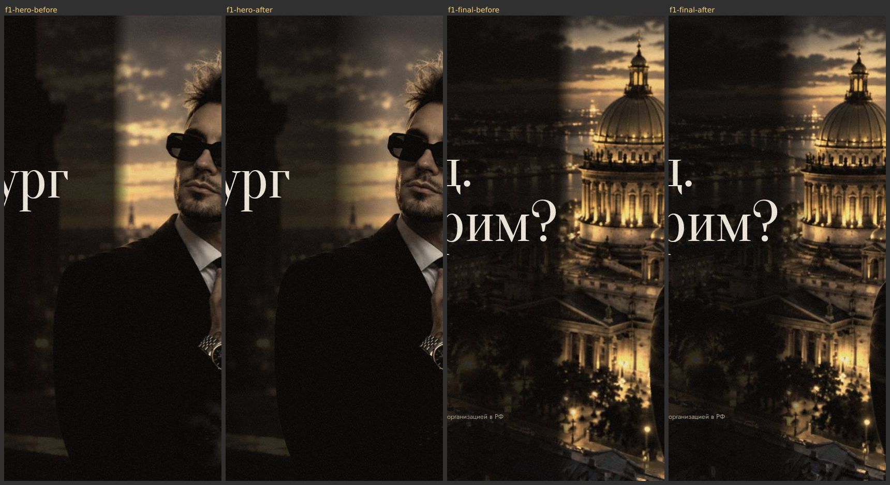
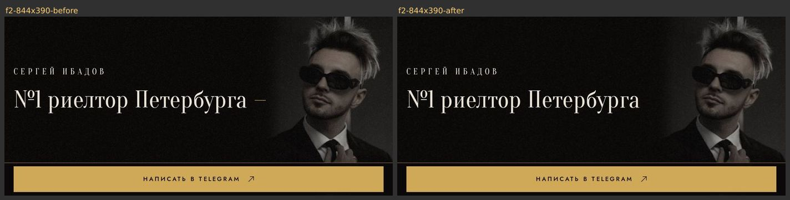
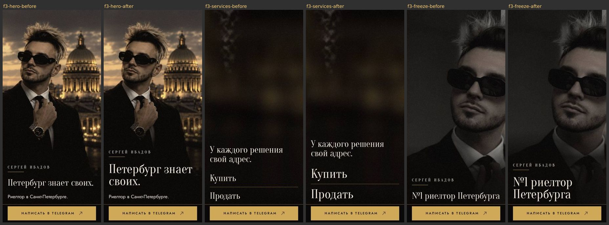
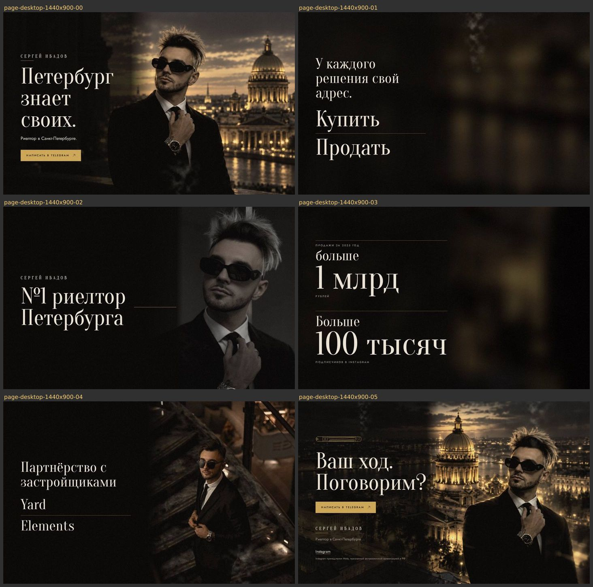
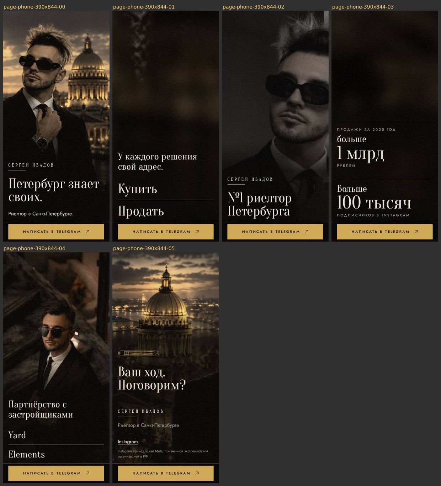
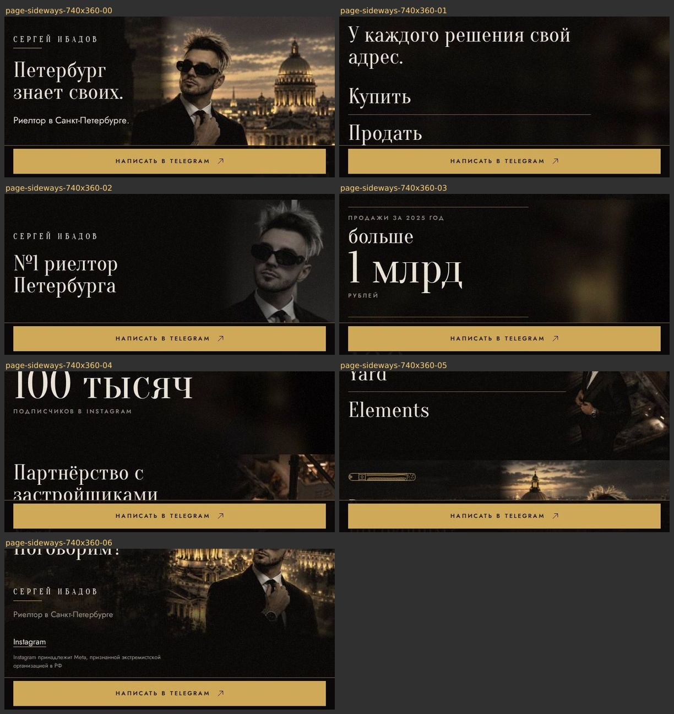

# Визуальная проверка

Лендинг Сергея Ибадова, ветка после второго мнения. 8 октября 2026.

## Итог

- Найдено три дефекта. Все три исправлены и проверены на скриншотах.
- Два места оставлены как есть, причины ниже.
- Композиция и ритм совпадают с макетом A. Все отличия — правки, утверждённые в Брифе.
- Оценка дизайна: B+ до правок, A− после.
- Шаблонности нет: оценка A до и после.
- Проверки в браузере: 50 из 50. Проверка HTML: 11 из 11.

## Как смотрели

- Собранный сайт этой ветки, браузер Chromium без окна.
- Каждую сцену снимали отдельно, с движением, после того как сцена отыграла.
- Вступление снимали кадрами с 0,7 до 5,6 с.
- Экраны:
  - компьютер: 1920×1080, 1440×900, 1366×768, 1280×720, 1024×768;
  - планшет стоймя: 768×1024;
  - телефон стоймя: 390×844, 375×667, 360×780;
  - телефон лёжа: 740×360, 844×390;
  - увеличение браузера: 200, 250 и 300% на окне 1280×633, 300% на окне 1440×789.
- Линию стоп-кадра мерили ещё на 2560×1440, 1920×1200, 1280×1024, 1280×800, 1200×800, 932×430 и 667×375.
- Макет A открывали в том же браузере на 1440×900, 390×844 и 740×360. Его снимали экран за экраном и сравнивали со страницей рядом.

## Первое впечатление

- Страница говорит: вечерний Петербург и человек в центре кадра. Это титры фильма, а не сайт агентства.
- Взгляд идёт так: лицо Сергея, затем «Петербург знает своих.», затем золотая кнопка. Это задуманная иерархия.
- Каждая область первого экрана понятна за секунду: кто он, чем занят, куда писать.
- Одним словом: кино.

## Сравнение с макетом A

Совпадает:

- Порядок глав: первый экран, «Купить / Продать», «№1», цифры, партнёры, финал.
- Первый экран: имя титром, под ним короткая золотая линия, крупный заголовок, строка, золотая кнопка. Текст слева, Сергей и собор справа.
- «Купить / Продать»: заголовок, ниже крупно два слова, между ними линия.
- Цифры: крупное число антиквой, подпись разреженными заглавными, линия над каждой цифрой.
- Партнёры: текст слева, фото у лестницы справа во всю высоту, имена с линией между ними.
- Финал: «Ваш ход. Поговорим?», кнопка, под ней имя, строка, Instagram и сноска.
- Ритм: каждая глава — сцена во весь экран, сцены идут подряд, на компьютере текст слева.
- На телефоне стоймя «Купить» и «Продать» крупнее заголовка, как в макете. До правки 3 ниже они были одного размера с ним.

Отличается, как решено в Брифе:

- Кадр первого экрана во весь экран, а не врезан справа под шапкой.
- Шапки с именем и меню нет.
- Убраны «Ваш следующий ход — здесь.», «Дальше по делу», «Санкт-Петербург» и «Начнём с вашего вопроса.».
- «Купить» и «Продать» — простой текст без стрелок.
- Линий на всю ширину между сценами нет.
- «№1 риелтор Петербурга» — подпись отдельного стоп-кадра с портретом, а не текст рядом с цифрами.
- Факты в формулировке заказчика: «больше», «100 тысяч», «Партнёрство с застройщиками».
- Фото партнёров уходит в ink слева, а не обрезано ровно по половине экрана.
- В финале кадр сверху с собором и Сергеем и сигара, а не голый чёрный. Поэтому имя и Instagram стоят в одну колонку слева, а не в две.
- Под «Купить / Продать» и цифрами размытый город, а не голый чёрный.
- На телефоне текст «Купить / Продать» и цифр стоит в нижней трети, а не сверху. Так Бриф ставит текст в вертикальной схеме.
- Добавлены вступление, движение камеры, дым, блик и зерно.

Отличается из-за DESIGN.md:

- На компьютере заголовок «У каждого решения свой адрес.» встаёт в три строки, в макете — в две. Колонка текста не шире 34rem.

## Дизайн-система на странице

- Шрифты: Oranienbaum 400 и Jost 400 и 500. Других нет.
- Цвета только из DESIGN.md: ink, text, text-muted, gold, gold-deep и amber во вспышке. Полоса на телефоне — ink с непрозрачностью 0,94.
- Самый мелкий текст — 13px: кнопка, подписи к цифрам, сноска.
- Кнопка 56px в высоту, ссылка Instagram 44px.
- Наведение и фокус кнопки и ссылки — как в DESIGN.md. Фокус с клавиатуры на телефоне не уходит под полосу: проверено на 390×844, 375×667 и 740×360.
- Горизонтальной прокрутки нет ни на одном экране.

## Исправлено

### 1. Край затемнения под текстом читался как панель

- Где: компьютер и телефон лёжа. Первый экран, «Купить / Продать», цифры, партнёры, финал и вступление.
- Было: затемнение под колонкой текста обрывалось за 32px. Получалась прямая вертикальная граница через небо и город, как край тёмной панели. DESIGN.md панели запрещает.
- Стало: затемнение уходит в прозрачное на всё свободное место до лица или купола. Это от 32 до 120px, конец за 8px до лица или купола. Под текстом затемнение по-прежнему 0,85.
- На 1440×900 переход теперь такой:
  - первый экран — 105px;
  - финал — 60px;
  - сцены без лица — 120px.
- В стоп-кадре и на узких экранах переход остался 32px: места до лица там нет.
- Коммит 3c6b8b7, файл src/blocks/story/scene.css.

Слева направо: первый экран до и после, финал до и после, 1440×900.

### 2. Обрубок золотой линии в стоп-кадре читался как тире

- Где: 1200×800, телефон лёжа 844×390 и 932×430.
- Было: линия к Сергею получала от 24 до 62px и стояла сразу после подписи: «№1 риелтор Петербурга —».
- Стало: линия короче 64px не рисуется. 64px — длина короткой золотой линии из DESIGN.md.
- На широких экранах линия прежняя, от 119 до 935px.
- Коммит 9fa9240, файл src/design/FreezeCaption.astro.

Телефон лёжа 844×390: до и после.

### 3. На телефоне стоймя крупные заголовки были размером title

- Было: на телефоне стоймя все заголовки `display` набирались размером `title`, 36px. «Купить» и «Продать» были не крупнее заголовка над ними, хотя Бриф просит «ниже крупно». DESIGN.md даёт `display` от 3rem.
- Стало: на телефоне стоймя `display` — от 48 до 53px. Крупнее заголовков глав теперь:
  - «Петербург знает своих.»;
  - «№1 риелтор Петербурга»;
  - «Купить» и «Продать»;
  - «Ваш ход. Поговорим?».
- Телефон лёжа и узкие широкие экраны остались на `title`, как в Брифе.
- От текста до лица по-прежнему не меньше 32px на всех экранах телефона из Брифа.
- Коммит 8c9f04a, файл src/design/base.css.

Телефон 390×844: первый экран, «Купить / Продать» и стоп-кадр, каждый до и после.

## Увеличение 200–300% и низ финала

- При 200–300% текст стоит слева на затемнении, кнопка — в полосе снизу. Лицо и купол свободны.
- При 300% первый экран виден частично, остальное — прокруткой. При таком увеличении это ожидаемо.
- При 300% имя «Сергей Ибадов» встаёт в две строки, а «Риелтор в Санкт-Петербурге.» переносится по дефису. Оба читаются.
- Финал: изображение высотой в экран плавно уходит в ink, шва нет. Instagram и сноска стоят на ink. Смотрели на 1280×720, 1366×768, 740×360, 844×390 и при 200%.
- Низ партнёров на телефоне лёжа и при 200% выглядит так же.

## Оставлено как есть

- **Линии стоп-кадра нет на 4:3, 5:4, 1200×800 и на телефоне лёжа.** Подпись там занимает всё место до лица. Пробовали сузить подпись, чтобы освободить место. Тогда линия отрывается от текста и висит посреди кадра, это хуже. Бриф просит линию в широкой схеме. Вернуть её можно, только если подпись всегда стоит в две строки, с переносом перед «Петербурга». Для этого подпись надо разбить на две части в разметке.
- **Отступ от заголовка до крупных слов — 40px.** Так в «Купить / Продать» и в партнёрах. DESIGN.md даёт от заголовка до текста 24px. Под заголовком здесь не строка текста, а крупные слова с линией между ними. С 40px они не слипаются с заголовком.
- **Страницу не понять по одним заголовкам.** Это замечание второго мнения. Заголовок «У каждого решения свой адрес.» не называет услуг, заголовок «Цифры» скрыт. Тексты утверждены в Брифе.

## Оценки

- Иерархия: B+ до правок, A после.
- Типографика: B+ до правок, A после.
- Сетка и отступы: B до правок, B+ после. Осталась линия стоп-кадра на узких экранах.
- Цвет и контраст: A.
- Наведение, фокус, нажатие: A.
- Разные экраны: A.
- Тексты: A.
- Шаблонность: A. Карточек, иконок в кружках, градиентов в тексте, свечений и стеклянных панелей нет.
- Движение: A. Кадры вступления идут по шагам Брифа: купол, склейка, балкон, затем заголовок.
- Скорость загрузки в этой проверке не мерили.

## Второе мнение и независимый обзор кода

- Другая модель прочла код и Бриф. Жёстких отказов нет. Одно замечание о заголовках, оно выше в «Оставлено как есть».
- Отдельный обзор кода на единство системы: критичных замечаний нет. Цвета только из токенов, точки перелома одни и те же во всех файлах, фокус один на всю страницу. Мелкие замечания о повторах в коде на вид страницы не влияют.

## Вся страница после правок

Экран за экраном, с движением.

Компьютер 1440×900:

Телефон стоймя 390×844:

Телефон лёжа 740×360:

## Проверки

- `bunx playwright test --project=layout` — 50 из 50, код выхода 0.
- `bun run test:html` — 11 из 11, код выхода 0.
- Сборка сайта — 16 встроенных проверок, ошибок нет.
